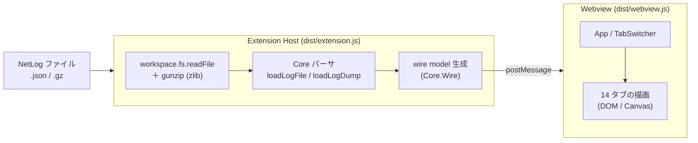

# 開発ガイド (DEVELOPMENT)

Netlog Viewer のアーキテクチャ・ビルド・デバッグ・パッケージング手順をまとめます。
本拡張機能は **F# → [Fable](https://fable.io/) → JavaScript → [esbuild](https://esbuild.github.io/) でバンドル** という流れで構築し、
パーサー / ビューアーなどのすべての実装は外部ランタイムライブラリに依存せず、フルスクラッチで実装しています。

---

## 目次

- [開発ガイド (DEVELOPMENT)](#開発ガイド-development)
  - [目次](#目次)
  - [設計と仕様](#設計と仕様)
    - [設計方針（依存関係）](#設計方針依存関係)
    - [アーキテクチャ](#アーキテクチャ)
    - [メッセージ（wire model）](#メッセージwire-model)
    - [技術スタック](#技術スタック)
    - [ファイル解析](#ファイル解析)
    - [レンダリング方針](#レンダリング方針)
    - [セキュリティ](#セキュリティ)
  - [必要環境](#必要環境)
  - [初回セットアップ](#初回セットアップ)
  - [ビルドの仕組み](#ビルドの仕組み)
  - [npm スクリプト](#npm-スクリプト)
  - [デバッグ実行 (F5)](#デバッグ実行-f5)
  - [テスト](#テスト)
  - [開発ワークフロー](#開発ワークフロー)
  - [パッケージング](#パッケージング)
  - [プロジェクト構成](#プロジェクト構成)
  - [トラブルシューティング](#トラブルシューティング)

---

## 設計と仕様

### 設計方針（依存関係）

本拡張機能は、**F# / JavaScript ともに標準ライブラリ以外の外部ライブラリを原則として利用しない** 方針で設計しています。

- **フルスクラッチ実装**: NetLog のパース・ドメインモデル・各タブの描画・タイムラインのキャンバス描画まで、すべて自前で実装します。
- **方針の理由**:
  - 依存ライブラリの脆弱性・破壊的変更・メンテナンス停止といったリスクを排除する
  - 拡張機能のサイズと読み込みコストを最小化する
  - 解析・描画の挙動を完全に制御し、読み取り専用・オフライン動作を保証する
- **例外**: ビルドツールチェーン（F# → JavaScript 変換を行う Fable、バンドラの esbuild、`.vsix` を生成する `@vscode/vsce`）、
  および VS Code 拡張ホストが提供する `vscode` API・Node.js 標準モジュール（`zlib` など）は対象外です。
  これらは実行時の機能ライブラリではなく、開発・配布・ホスト基盤として利用します。
  VS Code API と DOM への参照は、Fable.Browser などのパッケージを使わず **自前の最小バインディング**（`src/Extension/Vscode.fs` / `src/Webview/Dom.fs`）で賄います。

### アーキテクチャ

**Extension Host 側でファイルを解析（パース・正規化）し、構造化したモデルを Webview へ送信。Webview 側は描画に専念する** という分担です。
F# は 2 つのエントリ（Host / Webview）から、それぞれ独立した JavaScript バンドルへコンパイルされます。



- 起動経路: VS Code の **Custom Editor API**（`CustomReadonlyEditorProvider`）で、NetLog 風のファイル名パターンにカスタムエディターを登録します（`.json` を一律には乗っ取りません）。加えて `Netlog Viewer: Open File` コマンドで任意のファイルを開けます。
- Host はファイルを読み込み、`.gz` は Node の `zlib` で展開し、UTF-8 デコード後に Core パーサへ渡します。成功時は wire model を、失敗時は `{ type: "error" }` を Webview へ送ります。
- Webview は受信したモデルを保持し、各タブの `OnLoadLogFinish` を呼んで表示/非表示を決定します（該当データが無いタブは自動的に隠れます）。

### メッセージ（wire model）

Host → Webview は構造化クローン可能なプレーンオブジェクトのみを送ります（F# の `Map` や判別共用体は wire に載せません）。

- `webview → host`: `{ type: "ready" }`
- `host → webview`: `{ type: "load", fileName, loadLog, numericDate, baseTime, clientInfo, constants{ eventTypeNames, sourceTypeNames, timeTickOffset, logCaptureMode, raw }, events[], sources[], polledData, tabData, stats }`
- `host → webview`: `{ type: "error", message }`

`events[]` の `params` や `polledData` などの生 JSON はそのまま透過させ、Webview 側で必要に応じて Core の型へ復元します。

### 技術スタック

| 領域 | 採用技術 |
| --- | --- |
| 実装言語 | [F#](https://fsharp.org/) |
| JS へのコンパイル | [Fable](https://fable.io/) 5.x（`Fable.Core`） |
| VS Code API バインディング | 自前の最小バインディング（[src/Extension/Vscode.fs](./src/Extension/Vscode.fs)） |
| DOM / Canvas バインディング | 自前の最小バインディング（[src/Webview/Dom.fs](./src/Webview/Dom.fs)） |
| バンドル | [esbuild](https://esbuild.github.io/)（Host = CommonJS、Webview = IIFE） |
| ビルドオーケストレーション | npm スクリプト |
| パッケージング | [`@vscode/vsce`](https://github.com/microsoft/vscode-vsce) |
| 外部ランタイムライブラリ | 不使用（標準ライブラリのみ・フルスクラッチ実装） |

### ファイル解析

- パーサーは `src/Core`（純粋 F#、DOM/vscode 非依存）に実装し、Host・Webview の双方から再利用します。
- `LogParser.loadLogFile` はまず JSON としてパースし、`--log-net-log` 由来の途中切れログには末尾補完のフォールバックを行います。
- `constants` の検証（`logEventTypes` / `logEventPhase` / `logSourceType` / `netError` / `timeTickOffset` / `logFormatVersion` など）、イベントの妥当性フィルタ、`source.id` 単位のグルーピング（説明文・エラー/アクティブ状態・開始/終了時刻）を行います。
- イベント種別・ソース種別は数値 ID ではなく、ログに含まれる定数から解決した **名前** で判定します（ID はログ依存のため）。

### レンダリング方針

- **フルスクラッチ**: ビューアーは外部 UI ライブラリ・フレームワークを使わず、標準の DOM / Canvas のみで実装します。
- **読み取り専用**: Webview からファイルへの書き込みは行いません。
- **ログ由来の文字列はすべてテキストノードとして描画**し、生 HTML としては解釈しません（インジェクション対策）。

### セキュリティ

- Webview には厳格な **Content Security Policy（CSP）** を適用し、`script-src` は nonce 付きの自前スクリプトのみに限定、外部スクリプト・外部リソースの読み込みを禁止します。
- スクリプト/スタイルは `webview.asWebviewUri` で安全に変換した拡張機能内のリソースのみを参照します。
- 外部ネットワークへの通信は行いません（オフラインで完結します）。

---

## 必要環境

| ツール | バージョン | 用途 |
| --- | --- | --- |
| [.NET SDK](https://dotnet.microsoft.com/) | `10.0` 以降 | F# / Fable のビルド |
| [Node.js](https://nodejs.org/) | `18` 以降 | esbuild によるバンドル・テスト・パッケージング |
| [Visual Studio Code](https://code.visualstudio.com/) | `1.90.0` 以降 | 拡張機能のデバッグ実行 |

---

## 初回セットアップ

```bash
# .NET ローカルツール（Fable）の復元
dotnet tool restore

# npm 依存関係（esbuild / @vscode/vsce）の復元
npm install
```

`dotnet tool restore` は [.config/dotnet-tools.json](./.config/dotnet-tools.json) に定義された Fable を取得します。
初回の Fable 実行時に、Fable のランタイムライブラリ（`@fable-org/fable-library-js`）が `build/**/fable_modules/` へ展開されます。

---

## ビルドの仕組み

F# は Host・Webview の 2 系統に分かれ、それぞれ Fable → esbuild を通って独立した JS バンドルになります。

```
src/Core + src/Extension ──(dotnet fable)──▶ build/extension ──(esbuild --format=cjs  --external:vscode)──▶ dist/extension.js
src/Core + src/Webview   ──(dotnet fable)──▶ build/webview   ──(esbuild --format=iife)────────────────────▶ dist/webview.js
```

1. **Fable**: `src/Extension` と `src/Webview` を、それぞれ参照する `src/Core` ごと ES モジュール形式の JavaScript へトランスパイルします（出力はそれぞれ `build/extension` / `build/webview`）。
2. **esbuild**:
   - Host: エントリ `build/extension/Extension.js` を CommonJS（`vscode` は `--external`）へバンドルし `dist/extension.js` を生成。[package.json](./package.json) の `main` はこれを指します。
   - Webview: エントリ `build/webview/App.js` を IIFE へバンドルし `dist/webview.js` を生成。
3. Webview の HTML は Extension Host が（CSP・nonce を付与して）動的に生成し、`dist/webview.js` と [media/style.css](./media/style.css) を `asWebviewUri` 経由で読み込みます。

---

## npm スクリプト

| スクリプト | 説明 |
| --- | --- |
| `npm run fable` | F# を JavaScript へトランスパイル（Host・Webview の両方） |
| `npm run bundle` | esbuild で 2 つのバンドル（`dist/extension.js` / `dist/webview.js`）を生成 |
| `npm run build` | フルビルド（`fable` → `bundle`） |
| `npm run watch:webview` | Webview の F# を監視して再トランスパイル |
| `npm test` | Core のテストを Fable→Node で実行（`fable:tests` → `bundle:tests` → `node`） |
| `npm run clean` | Fable の出力・キャッシュを削除 |
| `npm run package` | `.vsix` を生成（`build` → `vsce package`） |

> 個別スクリプト（`fable:extension` / `fable:webview` / `bundle:extension` / `bundle:webview` / `fable:tests` / `bundle:tests`）も用意しています。詳細は [package.json](./package.json) を参照してください。

---

## デバッグ実行 (F5)

1. VS Code でこのリポジトリのルート（`netlog-viewer/`）を開きます。
2. `F5` を押す（または「実行とデバッグ」から **Run Extension** を選択）。
   - [.vscode/launch.json](./.vscode/launch.json) の設定により、`preLaunchTask` として `npm run build` が走ります。
   - ビルド成功後、拡張機能を読み込んだ **Extension Development Host** ウィンドウが起動します。
3. 起動したウィンドウで NetLog ログ（例: [samples/sample.netlog.json](./samples/sample.netlog.json) や `*net-export*.json`）を開くと、カスタムエディターで表示されます。

> 既定のエディターがテキストになっている場合は、ファイルを右クリック → **「Open With…」→ Netlog Viewer** を選択してください。

---

## テスト

Core のパーサとフィルタは純粋 F# のため、Fable で JS 化したうえで Node で実行します（DOM 非依存）。

```bash
npm test
```

- [tests/Core.Tests](./tests/Core.Tests) を Fable でビルドし、esbuild で CommonJS にまとめてから `node` で実行します。
- [samples/sample.netlog.json](./samples/sample.netlog.json) を入力に、パース結果・wire model・フィルタ言語（`SourceFilterParser`）などを検証します。
- DOM/Canvas に依存する Webview の描画コードは Node では実行できないため、ビルド成功と F5 での目視確認で担保します。

---

## 開発ワークフロー

ソースを変更したあとは、以下のいずれかで反映します。

- **手動ビルド**: `npm run build` を実行し、Extension Development Host で
  コマンドパレットの **Developer: Reload Window**（`⌘R` / `Ctrl+R`）を実行。
- **ウォッチ + 手動バンドル**: 1 つのターミナルで `npm run watch:webview`（Webview の Fable 監視）を起動しておき、
  必要なタイミングで `npm run bundle:webview` を実行してから Extension Development Host をリロード。

[media/style.css](./media/style.css) だけを変更した場合は、再ビルド不要でウィンドウのリロードのみで反映されます。

---

## パッケージング

```bash
npm run package
```

`npm run build`（Fable → esbuild）を実行したのち、`vsce package` で `netlog-viewer-<version>.vsix` を生成します。
`.vsix` に含めるファイルは [.vscodeignore](./.vscodeignore) で制御しており、F# ソース・`build/`・`tests/`・`samples/`・`node_modules` などは除外されます（実行時に必要なのは `dist/` と `media/` のみ）。

ローカルへインストールして確認する場合:

```bash
code --install-extension netlog-viewer-<version>.vsix
```

Marketplace への公開手順は [PUBLISHING.md](./PUBLISHING.md) を参照してください。

---

## プロジェクト構成

```
netlog-viewer/
├─ .config/dotnet-tools.json      # Fable ローカルツール
├─ .vscode/{launch,tasks}.json    # F5 デバッグ / ビルドタスク
├─ src/
│  ├─ Core/                       # パーサ・ドメインモデル・wire DTO（純粋 F#）
│  │  ├─ Json.fs  Model.fs  TimeUtil.fs  Constants.fs
│  │  └─ LogGrouper.fs  SourceGrouping.fs  LogParser.fs  Wire.fs
│  ├─ Extension/                  # Extension Host（カスタムエディター）
│  │  └─ Vscode.fs  Node.fs  NetlogEditor.fs  Extension.fs
│  └─ Webview/                    # Webview アプリ（14 タブ UI）
│     ├─ Dom.fs  TablePrinter.fs  View.fs  TabSwitcher.fs  Shell.fs
│     ├─ ImportView.fs  SourceFilterParser.fs  LogViewPainter.fs
│     ├─ DetailsView.fs  EventsView.fs  InfoViews.fs  Timeline.fs
│     └─ App.fs
├─ media/style.css                # Webview 用 CSS（HTML は Host が動的生成）
├─ tests/Core.Tests/              # Fable→Node テスト
├─ samples/sample.netlog.json     # 動作確認用サンプル
├─ dist/                          # ビルド成果物（extension.js / webview.js）
├─ build/                         # Fable 中間出力
└─ package.json / README.md / DEVELOPMENT.md / PUBLISHING.md / LICENSE
```

> `dist/` と `build/` はビルド生成物で、`.gitignore` の対象です。

---

## トラブルシューティング

| 症状 | 対処 |
| --- | --- |
| `dotnet fable` が見つからない | `dotnet tool restore` を実行する。 |
| Fable のビルドが固まる / 出力が古い | `npm run clean` でキャッシュを削除し、`npm run build` を再実行する。 |
| `esbuild` / `vsce` が見つからない | `npm install` を実行する。 |
| Extension Development Host に変更が反映されない | `npm run build` 後、`⌘R` / `Ctrl+R` でウィンドウをリロードする。 |
| Webview が空白のまま | 開発者ツール（**Developer: Open Webview Developer Tools**）でコンソールエラーを確認する。 |
| ファイルがテキストで開く | 右クリック → **「Open With…」→ Netlog Viewer**、またはコマンド **「Netlog Viewer: Open File」** を使う。 |
| 情報タブ（DNS/Proxy 等）が表示されない | そのログに該当 `polledData` が含まれていない可能性がある（データが無いタブは自動的に非表示）。 |
| `.vsix` にソースが含まれてしまう | [.vscodeignore](./.vscodeignore) の除外設定を確認する。 |
